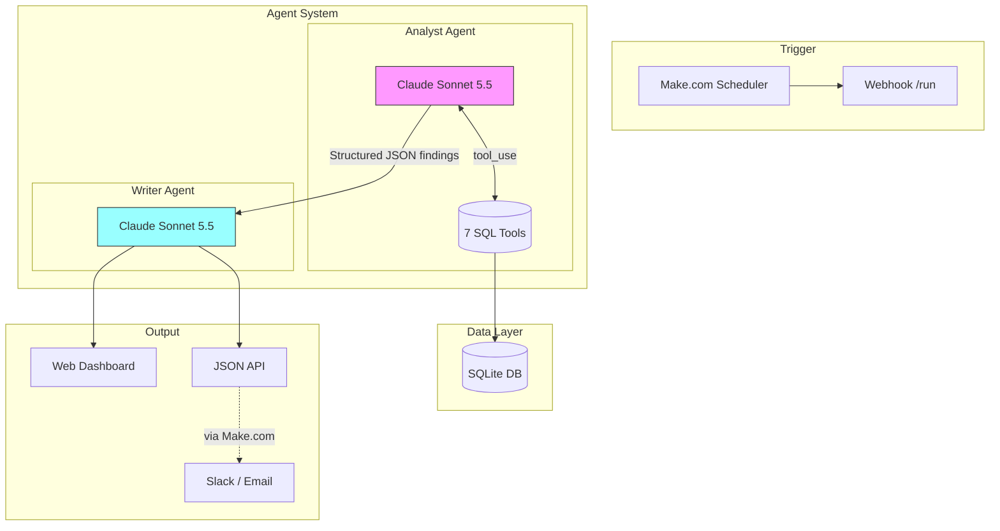

# Daily Ops Briefing

[](https://github.com/SmitHunter/Daily-Ops-Briefing/actions/workflows/ci.yml)
[](LICENSE)

A **two-agent AI system** that reviews multi-site retail performance and writes a daily ops briefing. Built with the Claude API, tool use, and Flask. A scheduler (Make.com or similar) can POST `/run` and then read `/latest.json` to send the briefing to Slack, email, or the included web dashboard.

## The Problem

Multi-site retail GMs are drowning in dashboards. Every store generates daily revenue, channel mix, category performance, and staffing data—but dashboards don't prioritise. By the time anyone notices a store has been underperforming for a week, it's late.

This system solves that by:
1. **Investigating autonomously** — an Analyst agent queries the data and identifies what matters
2. **Writing for humans** — a Writer agent produces a 60-second scannable briefing
3. **Running daily** — triggered by a webhook, delivers the briefing where leadership reads it

## Architecture



### Two-Agent Design

| Agent | Role | Tools | Output |
|-------|------|-------|--------|
| **Analyst** | Investigation | 7 SQL-backed tools | Structured JSON: headline, 3-6 findings with severity/evidence/actions, network stats |
| **Writer** | Communication | None | Markdown briefing formatted for 60-second scanning |

The agents have separate concerns by design:
- The **Analyst** decides *what matters*. It has access to all the data tools and must prioritise ruthlessly—if everything looks fine, it should say so with 1-2 findings.
- The **Writer** decides *how to say it*. It has no tools, only the Analyst's findings. Its job is voice, formatting, and scannability.

This separation means the Analyst can focus on investigation without worrying about prose, and the Writer can focus on communication without worrying about data access.

Both agents call `claude-sonnet-5-5`, the current generally available Sonnet ID on the [Claude API](https://docs.anthropic.com/en/docs/about-claude/models/overview).

## Tools

The Analyst has 7 tools that query a SQLite database:

| Tool | Purpose |
|------|---------|
| `list_stores` | Get all 31 stores with metadata (used to resolve names to IDs) |
| `network_summary` | High-level view: total revenue vs target, breakdowns by tier/region/channel |
| `store_performance` | Per-store actual vs target for a period, sorted worst-first |
| `store_trend` | Daily series for one store—distinguishes noise from sustained issues |
| `category_performance` | Revenue by product category with week-over-week comparison |
| `top_products` | Top sellers by revenue, filterable by category |
| `channel_comparison` | Sales by channel (in-store, kiosk, web, app, delivery) |

Tool descriptions are carefully written to guide the agent's routing decisions. For example, `network_summary` is described as "usually the first call to make" and `store_trend` is described as useful "to investigate whether a store's underperformance is a one-off or a sustained trend."

## Example Output

The numbers below are last-7-day aggregates from the **seeded synthetic dataset** (week ending 30 April 2026). They match `network_summary`, `store_performance`, `store_trend`, and `category_performance` on `data/pos.db` after `python setup_data.py`. Currency is rounded to the nearest dollar (Westbridge actual is $11,969.50; Northgate actual is $6,661.50). The prose is an **illustrative Writer-style briefing**, not a live Claude transcript.

### Briefing (Writer Output)

```markdown
*Daily Ops Briefing - Thursday 30 April 2026*

Network up *10.3%* on target this week, with 27 of 31 stores hitting numbers.

🔴 *Westbridge under target by 17.5%*
Revenue at *$11,970* against a *$14,500* target. This is the fifth day 
below target in the last seven—a pattern, not a blip.
Action: Check in with store manager to understand what's driving the shortfall.

🔴 *Northgate struggling to ramp*
Newest store at *-16.7%* variance, missing target 5 of the last 7 days.
Opened in February—still finding its feet.
Action: Review staffing levels and local marketing activation.

🟡 *Sandwiches softening*
Sandwich sales down *4.5%* week-over-week network-wide. Not critical, but 
worth watching.

🟢 *Wraps trending up*
Wrap sales up *4.0%* WoW.
No action needed.

---
27 of 31 stores above target. Network revenue $474,440 vs target $430,000 (+10.3%).
```

### Analyst Findings (Structured JSON)

```json
{
      "headline": "Network up 10.3% on target; two stores need attention",
  "findings": [
    {
      "title": "Westbridge under target by 17.5%",
      "severity": "high",
      "category": "store_performance",
      "evidence": {
        "store_id": "ST008",
        "actual": 11970,
        "target": 14500,
        "variance_pct": -17.5,
        "days_under_target_in_last_7": 5
      },
      "interpretation": "Sustained underperformance over the past week. Not noise.",
      "recommended_action": "Check in with store manager"
    }
  ],
  "stats": {
    "stores_above_target": 27,
    "stores_below_target": 4,
    "network_revenue": 474440,
    "network_target": 430000,
    "variance_pct": 10.3
  }
}
```

## Setup

### Prerequisites

- Python 3.11+
- [Anthropic API key](https://console.anthropic.com/)

### Local Development

```bash
# Clone the repository
git clone https://github.com/SmitHunter/Daily-Ops-Briefing.git
cd Daily-Ops-Briefing

# Create virtual environment
python -m venv .venv
source .venv/bin/activate  # or `.venv\Scripts\activate` on Windows

# Install dependencies
pip install -r requirements.txt

# Build the synthetic dataset (one-time)
python setup_data.py

# Set your API key
export ANTHROPIC_API_KEY=sk-ant-api03-your-key-here

# Run a one-shot briefing (CLI)
python agents.py

# Or start the web server
python app.py  # Serves on http://localhost:8080
```

### Environment Variables

Copy `.env.example` to `.env` and configure:

```bash
# Required
ANTHROPIC_API_KEY=sk-ant-api03-your-key-here

# Optional: protect /run endpoint with a token
BRIEFING_TOKEN=your-secret-token

# Optional: server port (default 8080)
PORT=8080
```

### Running Tests

```bash
# Install dev dependencies
pip install -e ".[dev]"

# Run tests (no API key needed — Claude is mocked)
pytest

# Run with coverage
pytest --cov=. --cov-report=term-missing

# Lint, format, and type-check
ruff check .
ruff format --check .
mypy agents.py tools.py app.py
```

## Deployment

The system is designed for Render's free tier but works on any Python hosting.

### Render (Recommended)

1. Fork this repository
2. Create a new Web Service on [Render](https://render.com)
3. Connect your fork
4. Render auto-detects the `render.yaml` config
5. Add environment variables: `ANTHROPIC_API_KEY`, optionally `BRIEFING_TOKEN`

The free tier sleeps after 15 minutes of inactivity. First request after sleep takes ~30 seconds to wake.

### Automation with Make.com

1. Create a Make.com scenario with a Schedule trigger (e.g., 7am daily)
2. Add an HTTP module that POSTs to `https://your-app.onrender.com/run?key=YOUR_TOKEN`
3. Add a Slack/Email module that reads from `/latest.json` and sends the briefing

## API Endpoints

| Method | Path | Description |
|--------|------|-------------|
| `GET` | `/` | HTML dashboard showing the latest briefing |
| `POST` | `/run` | Trigger a fresh briefing run |
| `GET` | `/run` | Same as POST (convenience for testing) |
| `GET` | `/latest.json` | Latest briefing as JSON |
| `GET` | `/health` | Health check for uptime monitoring |

If `BRIEFING_TOKEN` is set, `/`, `/run`, and `/latest.json` require `?key=TOKEN` or an `X-Access-Token: TOKEN` header. `/health` stays public so uptime checks do not need the token.

## Project Structure

```
.
├── agents.py                 # Analyst + Writer agents, orchestration
├── tools.py                  # 7 tool functions + Claude schemas
├── app.py                    # Flask service (dashboard + API)
├── setup_data.py             # Data pipeline runner
├── generate_transactions.py  # Synthetic transaction generator
├── build_products.py         # Invented product catalogue
├── build_db.py               # JSON → SQLite loader
├── build_stores.py           # 31-store network definition
├── data/
│   ├── stores.json           # Store metadata (committed)
│   ├── products.json         # Synthetic catalogue (committed)
│   └── pos.db                # Built at deploy time (gitignored)
├── tests/                    # Pytest suite with mocked Claude
├── .github/workflows/ci.yml  # GitHub Actions CI
├── pyproject.toml            # Project config, ruff, pytest
├── requirements.txt          # Production dependencies
└── render.yaml               # Render deployment config
```

## Design Decisions

### Why two agents instead of one?

A single agent could do both investigation and writing, but separation has benefits:
- **Clearer system prompts** — Each agent has one job with focused instructions
- **Easier debugging** — The Analyst's JSON output is inspectable before the Writer transforms it
- **Composability** — The Analyst findings could feed multiple outputs (Slack, email, PDF) without re-running analysis
- **Different failure modes** — If the Writer produces bad prose, the Analyst findings are still valid

### Why tool descriptions matter more than prompt tuning

Early iterations spent time tuning the Analyst's system prompt. The real breakthrough came from rewriting tool descriptions to explain *when* each tool fits in the workflow:
- "Usually the first call to make" (network_summary)
- "Use to investigate whether underperformance is a one-off or a sustained trend" (store_trend)
- "Use to drill into category-level findings" (top_products)

The agent routes much better when tools explain their role in the investigation flow, not just what they return.

### Why synthetic data?

Real POS data is sensitive. The synthetic dataset:
- Uses an invented catalogue (`build_products.py`) with generic names, made-up PLUs, and round prices
- Models multi-site cafe/QSR patterns (weekday/weekend variance, payday spikes, channel mix)
- Includes deliberate store anomalies for the agent to find (Westbridge at -17.5%, Northgate struggling to ramp)
- Is deterministic (fixed random seed) so every deployment produces identical data
- Keeps the repo small (source JSON only; the SQLite DB is built at deploy time)

### Why SQLite?

The full system would query a data warehouse, but SQLite:
- Requires no external services for demos and local development
- Is fast enough for the 30-day, 31-store dataset
- Is built from JSON at deploy time, keeping the repo portable

## License

MIT — see [LICENSE](LICENSE).

## Screenshots

### Make.com Automation

