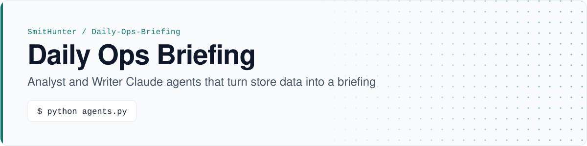
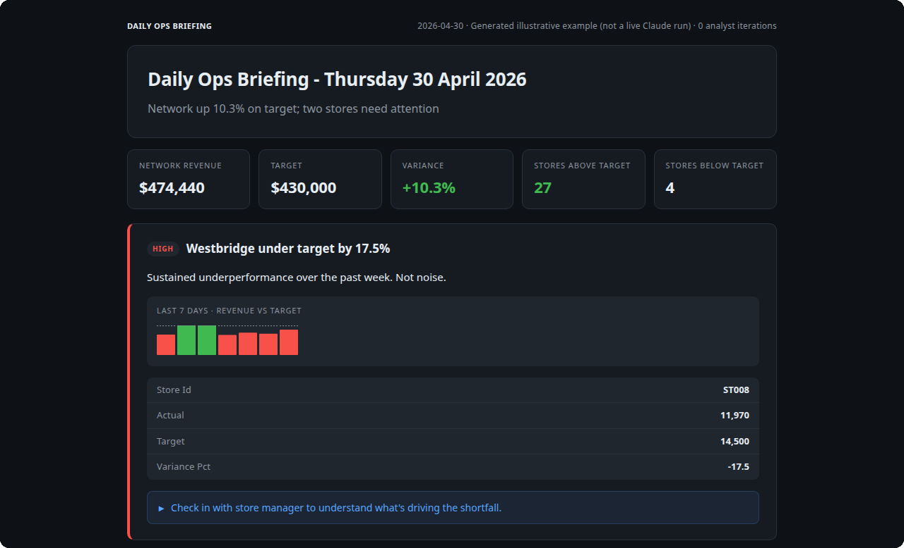
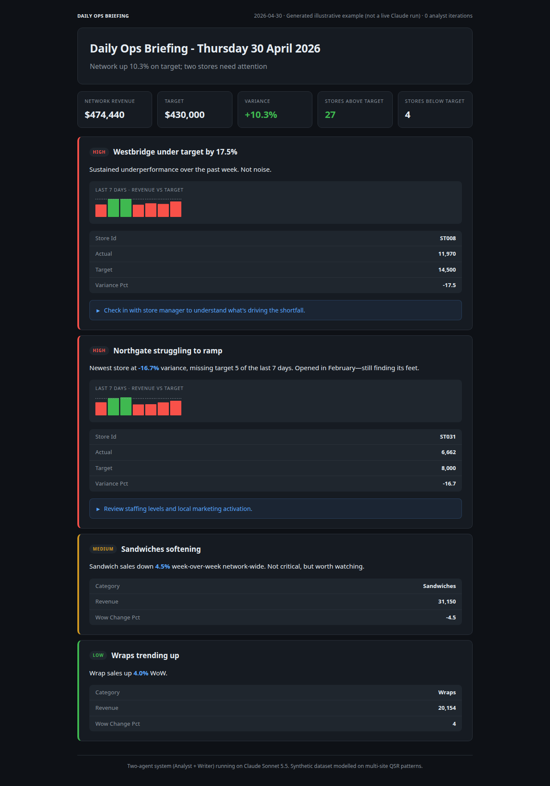
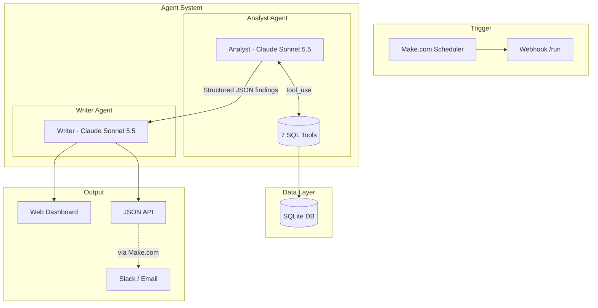
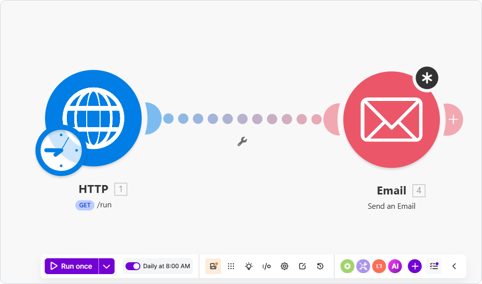

<p align="center">
  <picture>
    <source media="(prefers-color-scheme: dark)" srcset="assets/brand/banner-dark.svg">
    <source media="(prefers-color-scheme: light)" srcset="assets/brand/banner-light.svg">
    
  </picture>
</p>

<p align="center">
  <a href="https://github.com/SmitHunter/Daily-Ops-Briefing/actions/workflows/ci.yml"></a>
  <a href="pyproject.toml"></a>
  <a href="LICENSE"></a>
</p>

<p align="center"><a href="#example-output">Example output</a> · <a href="#quickstart">Quickstart</a> · <a href="#how-it-works">How it works</a> · <a href="#limitations">Limitations</a></p>

Two Claude agents review a synthetic 31-store network and write a daily ops briefing. The Analyst queries SQLite through 7 tools and returns structured findings; the Writer turns them into a 60-second Markdown briefing. Flask serves a dashboard, `/latest.json`, and a `/run` webhook for a scheduler such as Make.com.

<p align="center">
  
</p>

<p align="center"><sub>Flask dashboard at <code>/</code> from a local run on seeded synthetic data</sub></p>

> [!NOTE]
> The dashboard is rendering the illustrative example briefing below, not a live Claude run. A live-run capture will replace it.

## Example output

The numbers below are last-7-day aggregates from the **seeded synthetic dataset** (week ending 30 April 2026). They match `network_summary`, `store_performance`, `store_trend`, and `category_performance` on `data/pos.db` after `python setup_data.py`. Currency is rounded to the nearest dollar (Westbridge actual is $11,969.50; Northgate actual is $6,661.50). The prose is an **illustrative Writer-style briefing**, not a live Claude transcript.

### Briefing (Writer output)

```markdown
*Daily Ops Briefing - Thursday 30 April 2026*

Network up *10.3%* on target this week, with 27 of 31 stores hitting numbers.

🔴 *Westbridge under target by 17.5%*
Revenue at *$11,970* against a *$14,500* target. This is the fifth day 
below target in the last seven—a pattern, not a blip.
Action: Check in with store manager to understand what's driving the shortfall.

🔴 *Northgate struggling to ramp*
Newest store at *-16.7%* variance, missing target 5 of the last 7 days.
Opened in February—still finding its feet.
Action: Review staffing levels and local marketing activation.

🟡 *Sandwiches softening*
Sandwich sales down *4.5%* week-over-week network-wide. Not critical, but 
worth watching.

🟢 *Wraps trending up*
Wrap sales up *4.0%* WoW.
No action needed.

---
27 of 31 stores above target. Network revenue $474,440 vs target $430,000 (+10.3%).
```

<details>
<summary><b>Analyst findings (structured JSON)</b></summary>

```json
{
  "headline": "Network up 10.3% on target; two stores need attention",
  "findings": [
    {
      "title": "Westbridge under target by 17.5%",
      "severity": "high",
      "category": "store_performance",
      "evidence": {
        "store_id": "ST008",
        "actual": 11970,
        "target": 14500,
        "variance_pct": -17.5,
        "days_under_target_in_last_7": 5
      },
      "interpretation": "Sustained underperformance over the past week. Not noise.",
      "recommended_action": "Check in with store manager"
    }
  ],
  "stats": {
    "stores_above_target": 27,
    "stores_below_target": 4,
    "network_revenue": 474440,
    "network_target": 430000,
    "variance_pct": 10.3
  }
}
```

</details>

<details>
<summary><b>Full dashboard screenshot</b></summary>

<p align="center">
  
</p>

</details>

## Problem

Multi-site retail GMs are drowning in dashboards. Every store generates daily revenue, channel mix, category performance, and staffing data—but dashboards don't prioritise. By the time anyone notices a store has been underperforming for a week, it's late.

- An Analyst agent queries the data and decides what matters.
- A Writer agent turns the findings into a briefing someone can read in a minute.
- A webhook runs it daily and delivers it where people already read.

## How it works



### Two agents

| Agent | Role | Tools | Output |
|-------|------|-------|--------|
| **Analyst** | Investigation | 7 SQL-backed tools | Structured JSON: headline, 3-6 findings with severity/evidence/actions, network stats |
| **Writer** | Communication | None | Markdown briefing formatted for 60-second scanning |

- The **Analyst** decides *what matters*: it has the data tools and must prioritise (1–2 findings if all is well).
- The **Writer** decides *how to say it*: no tools, only the Analyst's JSON.

Both agents call `claude-sonnet-5-5`, the current generally available Sonnet ID on the [Claude API](https://docs.anthropic.com/en/docs/about-claude/models/overview).

### Analyst tools

The Analyst has 7 tools that query a SQLite database:

| Tool | Purpose |
|------|---------|
| `list_stores` | Get all 31 stores with metadata (used to resolve names to IDs) |
| `network_summary` | High-level view: total revenue vs target, breakdowns by tier/region/channel |
| `store_performance` | Per-store actual vs target for a period, sorted worst-first |
| `store_trend` | Daily series for one store—distinguishes noise from sustained issues |
| `category_performance` | Revenue by product category with week-over-week comparison |
| `top_products` | Top sellers by revenue, filterable by category |
| `channel_comparison` | Sales by channel (in-store, kiosk, web, app, delivery) |

Tool descriptions are carefully written to guide the agent's routing decisions. For example, `network_summary` is described as "usually the first call to make" and `store_trend` is described as useful "to investigate whether a store's underperformance is a one-off or a sustained trend."

## Quickstart

### Prerequisites

- Python 3.11+
- [Anthropic API key](https://console.anthropic.com/)

### Local development

```bash
git clone https://github.com/SmitHunter/Daily-Ops-Briefing.git
cd Daily-Ops-Briefing

python -m venv .venv
source .venv/bin/activate  # or `.venv\Scripts\activate` on Windows

pip install -r requirements.txt

python setup_data.py

export ANTHROPIC_API_KEY=sk-ant-api03-your-key-here

python agents.py

python app.py  # Serves on http://localhost:8080
```

<details>
<summary><b>Environment variables</b></summary>

Copy `.env.example` to `.env` and configure:

```bash
# Required
ANTHROPIC_API_KEY=sk-ant-api03-your-key-here

# Optional: protect /run endpoint with a token
BRIEFING_TOKEN=your-secret-token

# Optional: server port (default 8080)
PORT=8080
```

</details>

## Tests and output checks

```bash
pip install -e ".[dev]"

pytest

pytest --cov=. --cov-report=term-missing

ruff check .
ruff format --check .
mypy agents.py tools.py app.py
```

### Output validators

`tests/test_eval.py` defines validators for both agent outputs. They are real checks with failing cases, not a hardcoded happy-path fixture. Pytest runs them in CI (Claude is mocked). The same functions can be pointed at a live Analyst/Writer payload later.

**Analyst JSON** (`findings_errors`):

- `headline` is a non-empty string
- `findings` is a list of 1–8 items (more than 8 is treated as poor prioritisation)
- each finding has `title`, `severity`, `category`, `evidence`, `interpretation`
- `severity` is one of `high`, `medium`, `low`
- `evidence` is an object
- `stats` includes `stores_above_target`, `stores_below_target`, `network_revenue`, `network_target`, `variance_pct`, all numeric

**Writer markdown** (`briefing_errors`):

- header contains `*Daily Ops Briefing` and a date
- at least one severity emoji (🔴 / 🟡 / 🟢)
- key numbers are bolded with `*...*`
- a high-severity finding includes an `Action:` line
- network footer mentions stores or target
- raw JSON and placeholder tokens (`TODO`, `FIXME`, …) are rejected

## Deploy

The system is designed for Render's free tier but works on any Python hosting.

### Render

1. Fork this repository
2. Create a new Web Service on [Render](https://render.com)
3. Connect your fork
4. Render auto-detects the `render.yaml` config
5. Add environment variables: `ANTHROPIC_API_KEY`, optionally `BRIEFING_TOKEN`

The free tier sleeps after 15 minutes of inactivity. First request after sleep takes ~30 seconds to wake.

### Make.com

The screenshot is a Make.com scenario: **Daily at 8:00 AM**, HTTP **GET `/run`**, then **Email**.

GET `/run` is a convenience alias for POST `/run`; both trigger a briefing. If a later step needs the markdown rather than just kicking off a run, read `GET /latest.json`.

<p align="center">
  
</p>

### Endpoints

| Method | Path | Description |
|--------|------|-------------|
| `GET` | `/` | HTML dashboard showing the latest briefing |
| `POST` | `/run` | Trigger a fresh briefing run |
| `GET` | `/run` | Same as POST (convenience for testing) |
| `GET` | `/latest.json` | Latest briefing as JSON |
| `GET` | `/health` | Health check for uptime monitoring |

If `BRIEFING_TOKEN` is set, `/`, `/run`, and `/latest.json` require `?key=TOKEN` or an `X-Access-Token: TOKEN` header. `/health` stays public so uptime checks do not need the token.

## Design decisions

### Why two agents instead of one?

A single agent could do both investigation and writing, but separation has benefits:
- **Clearer system prompts.** Each agent has one job with focused instructions
- **Easier debugging.** The Analyst's JSON output is inspectable before the Writer transforms it
- **Composability.** The Analyst findings could feed multiple outputs (Slack, email, PDF) without re-running analysis
- **Different failure modes.** If the Writer produces bad prose, the Analyst findings are still valid

### Why tool descriptions matter more than prompt tuning

In development, rewriting tool descriptions to say *when* each tool fits improved routing more than system-prompt tuning did:
- "Usually the first call to make" (network_summary)
- "Use to investigate whether underperformance is a one-off or a sustained trend" (store_trend)
- "Use to drill into category-level findings" (top_products)

The agent routes much better when tools explain their role in the investigation flow, not just what they return.

### Why synthetic data?

Real POS data is sensitive. The synthetic dataset:
- Uses an invented catalogue (`build_products.py`) with generic names, made-up PLUs, and round prices
- Models multi-site cafe/QSR patterns (weekday/weekend variance, payday spikes, channel mix)
- Includes deliberate store anomalies for the agent to find (Westbridge at -17.5%, Northgate struggling to ramp)
- Is deterministic (fixed random seed) so every deployment produces identical data
- Keeps the repo small (source JSON only; the SQLite DB is built at deploy time)

### Why SQLite?

The full system would query a data warehouse, but SQLite:
- Requires no external services for demos and local development
- Is fast enough for the 30-day, 31-store dataset
- Is built from JSON at deploy time, keeping the repo portable

## Limitations

- **Synthetic data only.** The catalogue, 31 stores, and 30 days of transactions are generated (`setup_data.py`, fixed random seed). There is no live POS feed. Store names are invented.
- **The README example is not a live Claude run.** The Writer markdown and Analyst JSON under Example Output are an illustrative payload aligned with the seeded last-7-day aggregates. Tests mock the Claude API; CI does not call Anthropic.
- **Each run costs a Claude API sequence.** The Analyst may loop up to 12 times (`max_tokens=4096` per call, with tool use). The Writer is one further call (`max_tokens=2048`). Both use `claude-sonnet-5-5`. This repo does not log token usage or dollar cost.
- **GET `/run` is a convenience alias for POST.** It triggers a new briefing (not idempotent). The Make.com screenshot uses GET because that is easy to wire in an HTTP module.
- **Render free tier sleeps after 15 minutes idle.** The first request after sleep takes ~30 seconds to wake. The latest briefing is stored in process memory, so a sleep or restart clears it until the next `/run`.

## Project layout

<details>
<summary><b>Repository tree</b></summary>

```text
.
├── agents.py                 # Analyst + Writer agents, orchestration
├── tools.py                  # 7 tool functions + Claude schemas
├── app.py                    # Flask service (dashboard + API)
├── setup_data.py             # Data pipeline runner
├── generate_transactions.py  # Synthetic transaction generator
├── build_products.py         # Invented product catalogue
├── build_db.py               # JSON → SQLite loader
├── build_stores.py           # 31-store network definition
├── data/
│   ├── stores.json           # Store metadata (committed)
│   ├── products.json         # Synthetic catalogue (committed)
│   └── pos.db                # Built at deploy time (gitignored)
├── tests/                    # Pytest suite with mocked Claude
│   └── test_eval.py          # Analyst/Writer output validators
├── assets/
│   ├── brand/                # Light/dark README banners
│   ├── dashboard.png         # Full illustrative dashboard capture
│   ├── dashboard-hero.png    # Crop below the first finding card
│   └── makecom.png           # Make.com GET /run → Email scenario
├── .github/workflows/ci.yml  # GitHub Actions CI
├── pyproject.toml            # Project config, ruff, pytest
├── requirements.txt          # Production dependencies
└── render.yaml               # Render deployment config
```

</details>

## License

MIT — see [LICENSE](LICENSE).

---
Built by **Hunter Smith**, AI Engineer, Melbourne · [GitHub](https://github.com/SmitHunter) · [LinkedIn](https://www.linkedin.com/in/hunter-sm/)
